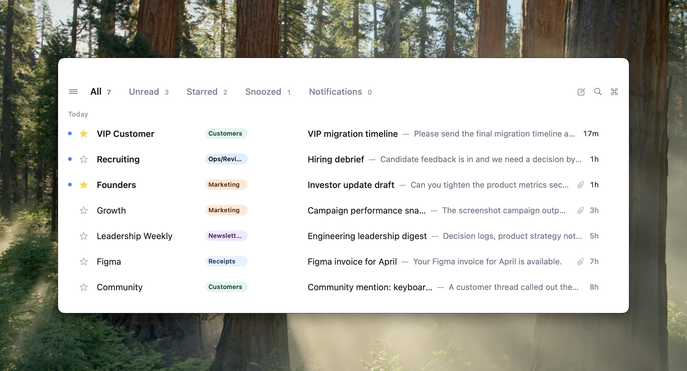

# Inbox Zero Mail

**The open-source, privacy-first native desktop email client.** The current client is built with Native SDK using declarative native markup and Zig, without Electron or an embedded browser runtime.



## Why Inbox Zero Mail?

Most modern email clients are Electron apps. Inbox Zero Mail uses Native SDK's native renderer and keeps mail state and provider logic in Zig. The earlier Swift implementation remains in this repository while the Native SDK client reaches parity.

It is also yours. The code is open source, the architecture is modular, and the app is easy to hack on: point Claude Code, Codex, or your editor at the repo and change the workflow, UI, shortcuts, or provider behavior to match how you actually handle email.

**Want AI-powered email features?** Check out [getinboxzero.com](https://getinboxzero.com), our companion open-source project for AI triage, auto-responses, and more.

> **Beta notice:** Inbox Zero Mail is under active development. We use it daily, but you may encounter rough edges. Bug reports and contributions are very welcome!

## Highlights

- 🛠️ **Open source & hackable** -- fork it, theme it, add features, or ask Claude Code/Codex to make the email client you want.
- 🔒 **Privacy-first** -- your mail talks directly to Gmail or Microsoft Graph and OAuth tokens stay in the operating system credential store.
- ⚡ **Native SDK + Zig** -- native-rendered UI without an Electron or WebView application shell.
- 📬 **First-class multi-address support** -- connect multiple Gmail accounts today, with Outlook/Microsoft support coming soon. See every address in one unified view, split inbox tabs, or separate windows.
- ⌨️ **Keyboard-first workflow** -- navigate your entire inbox without touching the mouse. Archive, reply, star, snooze, switch views, and run actions from the keyboard.
- 🔎 **Command palette** (<kbd>Cmd</kbd>+<kbd>K</kbd>) -- jump to any action, account, or label instantly.
- 🗂️ **Split inbox** -- organize your inbox into customizable tabs (Unread, Starred, Snoozed, by label, or custom search queries).

## Features

| Feature | Status |
|---|---|
| Gmail support | Stable |
| Outlook support | Available for source builds; not configured in the first public package |
| Unified multi-account inbox | Stable |
| Split inbox with custom tabs | Stable |
| Command palette (<kbd>Cmd</kbd>+<kbd>K</kbd>) | Stable |
| Keyboard shortcuts | Stable |
| Thread view & conversation grouping | Stable |
| Compose (inline, floating, fullscreen) | Stable |
| Archive, star, snooze, read/unread | Stable |
| Labels & label management | Planned |
| Search | Beta |
| Multi-select & bulk actions | Planned |
| Focus & split layout modes | Beta |
| Undo actions | Planned |
| Attachments and rich compose | Planned |
| Auto-updates | Planned; v1 uses manual downloads |

## Keyboard Shortcuts

| Key | Action |
|---|---|
| <kbd>Cmd</kbd>+<kbd>K</kbd> | Command palette |
| <kbd>Cmd</kbd>+<kbd>B</kbd> | Toggle sidebar |
| <kbd>C</kbd> | Compose |
| <kbd>E</kbd> | Archive / unarchive |
| <kbd>S</kbd> | Star / unstar |
| <kbd>Shift</kbd>+<kbd>U</kbd> | Toggle read / unread |
| <kbd>H</kbd> | Snooze |
| <kbd>Cmd</kbd>+<kbd>R</kbd> | Refresh inbox |
| <kbd>Cmd</kbd>+<kbd>Shift</kbd>+<kbd>N</kbd> | Add Gmail account |

## Getting Started

### Download

Download the latest macOS release:

[Download Inbox Zero for macOS](../../releases/latest)

On the release page, download `Inbox-Zero-Native-*.dmg` and drag
`Inbox Zero Mail.app` to your Applications folder.

The first Native SDK release targets Apple Silicon macOS. Windows packaging is
available for source builds and will follow as a public installer.

### Build from Source

Requires Node.js 24, Docker, and the native platform build dependencies.

```bash
git clone https://github.com/inbox-zero/inbox-zero-mail.git
cd inbox-zero-mail
./NativeApp/scripts/run-demo.sh
```

That script starts a local email emulator, builds the app, and opens it with
demo mail. To reuse the Google OAuth settings configured for the Swift client,
create `Config/LocalSecrets.xcconfig` and run:

```bash
./NativeApp/scripts/run-real.sh
```

See [NativeApp/README.md](NativeApp/README.md) for packaging, OAuth, testing,
and provider details.

## Privacy

Inbox Zero Mail talks directly to Gmail and Microsoft Graph. OAuth tokens are
stored in the operating system credential store and do not enter the UI model
or automation effect journal. Debug and automation recordings can contain mail
content and should never be published from real accounts.

## Architecture

The release client lives in `NativeApp/`:

```
NativeApp
 +-- src/app.native   -- declarative native UI
 +-- src/main.zig     -- app update loop and window coordination
 +-- src/model.zig    -- shared multi-window mail store
 +-- src/providers/   -- Gmail and Microsoft Graph behavior
 +-- src/platform/    -- OAuth, credential storage, and trusted I/O
```

## Contributing

We'd love your help! See [CONTRIBUTING.md](CONTRIBUTING.md) for development setup, running tests, and project conventions.

## License

AGPL-3.0
